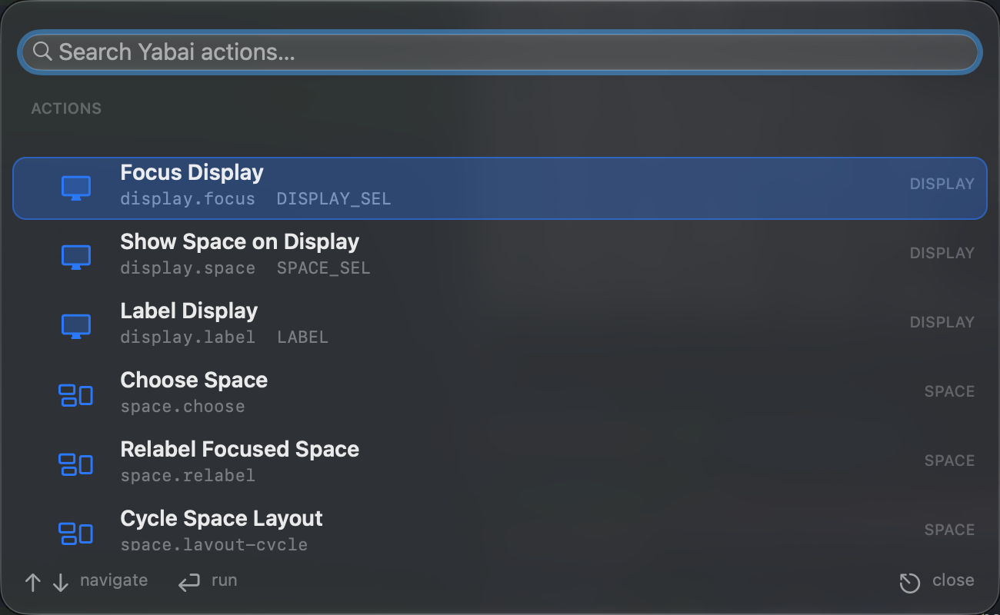
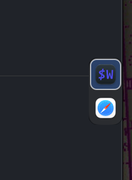
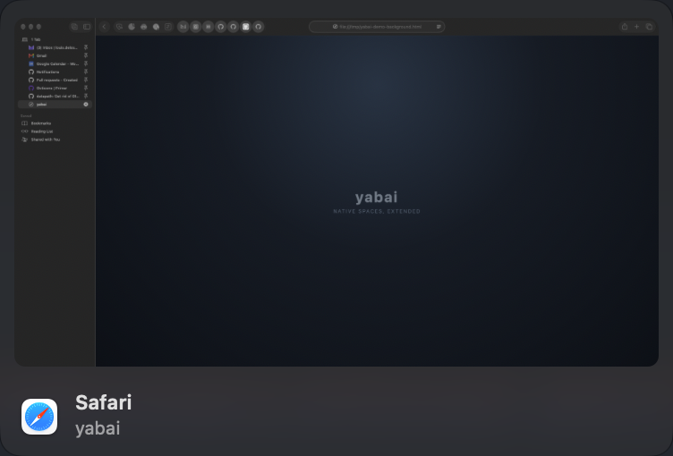

<!-- GitHub is particular about HTML-like markup in Markdown. Keep the header HTML simple. -->
<p align="center">
  
</p>

<h1 align="center">yabai for macOS 27+</h1>

<p align="center">
  A bleeding-edge, drop-in yabai fork with native command surfaces, stack navigation, workspace status, and automatic space cleanup.
</p>

<p align="center">
  <a href="LICENSE.txt"></a>
  <a href="doc/yabai.asciidoc"></a>
  
  <a href="https://github.com/asmvik/yabai"></a>
</p>

> [!IMPORTANT]
> This fork supports macOS 27 and later only.
> It deliberately follows the newest private macOS APIs and does not provide compatibility support for older macOS releases.

## What is this fork?

This repository is a maintained fork of [asmvik/yabai](https://github.com/asmvik/yabai) that tracks upstream development while adding a small set of native macOS workflows and interfaces.

It is intended to be a complete drop-in replacement for yabai.

The executable remains `yabai`, existing message domains and configuration files continue to work, and the launchd service and scripting-addition commands retain their upstream behavior.

The original upstream README is preserved in [README.upstream.md](README.upstream.md).

Full command details are available in the [yabai command reference](doc/yabai.asciidoc).

## Highlights

### Native command palette

The native command palette exposes common display, space, window, and runtime-setting actions through stable identifiers.

It supports keyboard navigation, search, argument entry, inline results, and confirmation for destructive actions.

<p align="center">
  
</p>

```sh
# Open the palette on the display containing the pointer.
yabai -m action --show

# Inspect the complete action catalog as JSON.
yabai -m action --list

# Run stable actions directly from skhd or a shell.
yabai -m action --run space.choose
yabai -m action --run space.relabel
yabai -m action --run space.layout-cycle
```

The native space chooser searches workspace names, focuses existing workspaces, and creates a labeled workspace when no name matches.

### Native stack selector

Stack layouts and stacked BSP leaves receive a compact, clickable application-icon selector.

The selector highlights the active window, focuses windows on click, supports window previews, and can be anchored independently for each stack.

| Stack selector | Hover preview |
|:--:|:--:|
|  |  |

```sh
yabai -m config stack_selector on
yabai -m config stack_selector_anchor vertical-center-left

# Override the focused stack without changing the global default.
yabai -m window --stack-selector-anchor horizontal-center-top
```

Right-clicking a selector opens a visual 3 by 4 anchor picker.

### Dynamic island status UI

Each display receives a native status island showing its current workspace and layout.

The built-in display merges into the physical notch, while external displays use a continuous pill.

<p align="center">
  
</p>

The workspace wing opens a per-display workspace selector.

The layout wing switches the current space between stack, BSP, and float layouts.

```sh
yabai -m config status_island on
yabai -m config status_island_workspace_order alphabetical
```

### Automatic empty-space cleanup

The native space cleaner removes empty, non-visible user spaces after windows move, windows close, or the visible workspace changes.

It preserves the currently visible workspace and the final user workspace on every display.

```sh
yabai -m config space_cleaner on
```

### macOS 27 scripting-addition support

This fork updates yabai's private-API and scripting-addition integration for macOS 27 and later.

Space creation, destruction, movement, focus, display placement, and animation control use the same public yabai commands as upstream.

## Fork option reference

### Action domain

| Command | Accepted values |
|:--|:--|
| `yabai -m action --show` | Opens the searchable action catalog. |
| `yabai -m action --list` | Returns every valid action identifier and its argument requirements as JSON. |
| `yabai -m action --run <ACTION_ID> [ARGUMENT]` | `<ACTION_ID>` may be any identifier returned by `--list`. Native workflow identifiers are `space.choose`, `space.relabel`, and `space.layout-cycle`. |

The layout-cycle workflow rotates through `stack`, `bsp`, and `float`.

### Global settings

| Setting | Accepted values | Default |
|:--|:--|:--|
| `stack_selector` | `on`, `off` | `off` |
| `stack_selector_anchor` | See the anchor values below. | `vertical-center-left` |
| `status_island` | `on`, `off` | `on` |
| `status_island_workspace_order` | `index`, `alphabetical`, `creation` | `index` |
| `space_cleaner` | `on`, `off` | `off` |

### Stack-selector anchors

The global `stack_selector_anchor` setting accepts these twelve values:

```text
vertical-top-left       vertical-center-left       vertical-bottom-left
vertical-top-right      vertical-center-right      vertical-bottom-right
horizontal-left-top     horizontal-center-top      horizontal-right-top
horizontal-left-bottom  horizontal-center-bottom   horizontal-right-bottom
```

The per-stack command accepts the same twelve anchors plus three control values:

```sh
yabai -m window --stack-selector-anchor <anchor>
yabai -m window --stack-selector-anchor next
yabai -m window --stack-selector-anchor prev
yabai -m window --stack-selector-anchor default
```

`next` and `prev` cycle through the twelve anchors.

`default` removes the focused stack's override and returns it to the global `stack_selector_anchor` setting.

### Dynamic-island selectors

The workspace menu contains the spaces belonging to that display.

The current workspace is listed first, and the remaining workspaces follow the configured `index`, `alphabetical`, or `creation` order.

The layout menu accepts `stack`, `bsp`, and `float`.

## Installation

### Homebrew

Release builds are distributed through the `ldelossa/yabai` Homebrew tap as a Formula.

```sh
brew install ldelossa/yabai/yabai
```

The installed command is still named `yabai`, so existing scripts, `skhd` bindings, configuration paths, and launchd workflows remain compatible.

### Start the service

Grant the installed `yabai` binary Accessibility permission in **System Settings → Privacy & Security → Accessibility**, then start the user service:

```sh
yabai --start-service
```

The standard service commands remain available:

```sh
yabai --start-service
yabai --restart-service
yabai --stop-service
```

### Scripting addition

The scripting addition is optional, but it is required for privileged space-management functionality such as creating, destroying, moving, and directly focusing spaces.

It has the same SIP and sudo requirements as upstream yabai.

After installing or upgrading the Formula, load the matching scripting addition with:

```sh
sudo yabai --load-sa
```

Reload it after Dock restarts, after rebooting, or after replacing the installed yabai binary.

For SIP requirements and a hash-pinned passwordless sudo rule, follow the upstream [scripting-addition installation guide](https://github.com/asmvik/yabai/wiki/Installing-yabai-%28latest-release%29#configure-scripting-addition).

## Suggested configuration

```sh
yabai -m config                                 \
    layout                       stack          \
    stack_selector               on             \
    status_island                on             \
    status_island_workspace_order alphabetical  \
    space_cleaner                on
```

Example `skhd` bindings:

```sh
alt - a : yabai -m action --show
alt - w : yabai -m action --run space.choose
alt - r : yabai -m action --run space.relabel
alt - o : yabai -m action --run space.layout-cycle
```

## Compatibility

| Area | Compatibility |
|:--|:--|
| Binary and IPC | Uses the existing `yabai` executable and `yabai -m` message interface. |
| Configuration | Existing `yabairc`, rules, signals, queries, and selectors remain supported. |
| Keyboard bindings | Existing `skhd` commands remain supported. |
| Service management | Uses upstream `--start-service`, `--restart-service`, and `--stop-service`. |
| Scripting addition | Uses upstream `sudo yabai --load-sa` workflow with a macOS 27-compatible payload. |
| Operating system | macOS 27 and later only. |

## Upstream documentation

This fork intentionally does not duplicate the complete yabai manual.

Use these references for the full upstream feature set and configuration model:

- [Preserved upstream README](README.upstream.md)
- [Command reference](doc/yabai.asciidoc)
- [Upstream wiki](https://github.com/asmvik/yabai/wiki)
- [Upstream changelog](https://github.com/asmvik/yabai/blob/master/CHANGELOG.md)
- [Upstream project](https://github.com/asmvik/yabai)

## Maintenance model

The fork's `master` branch is maintained as a small patch stack rebased onto `upstream/master`.

Fork releases are cut from tested rebases and published separately from upstream yabai releases.

## License and attribution

This fork remains licensed under the [MIT License](LICENSE.txt).

The original yabai project, documentation, artwork, and core implementation are maintained by [asmvik/yabai](https://github.com/asmvik/yabai) and its contributors.

The fork preserves upstream copyright and attribution.
